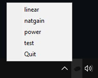

# Raw Accel Profile Switcher

This project is a basic program that helps you swap between multiple Raw Accel profiles/curves.



## Installation

Head to the [releases](https://github.com/itshappygolucky/RawAccel-Profile-Switcher/releases/) page, and extract the zip file. 

To load this program on boot, create a shortcut of `ra_switcher.exe` and add to startup folder.


## Getting Started

### Prerequisites

* RawAccel installed in the C: Drive as `C:\RawAccel\`
* Windows 10

### Adding Profiles

A new folder named "profiles" must be created in the `C:\RawAccel\` directory. Add up to 4 Raw Accel settings.json files. The name of the `.json` file dictates the name shown in the program. Example shown below:

```text
RawAccel\
└── Profiles\
    ├── profile1.json
    ├── profile2.json
    └── testprofile.json
```

## Acknowledgments
(Inspiration / Code Snippets)
* [k0nze](https://www.youtube.com/watch?v=Vrg4RhjxztE)
* [pynative](https://pynative.com/python-list-files-in-a-directory/)
* [Running .exe's](https://stackoverflow.com/questions/1811691/running-an-outside-program-executable-in-python)
* [Splitting File Extensions](https://stackoverflow.com/questions/27750611/how-can-i-strip-the-file-extension-from-a-list-full-of-filenames)

Link to original Raw Accel project: <https://github.com/a1xd/rawaccel/>

## Source Code Requirements
Should you wish to adapt the code, the following requirements are needed.
```python
pystray
pywin32
```
## Socials

* [Youtube](https://www.youtube.com/channel/UC1gkvM_-iRNaqnznF_NLMCg)
* [Twitter](https://twitter.com/itshappygolucky)
